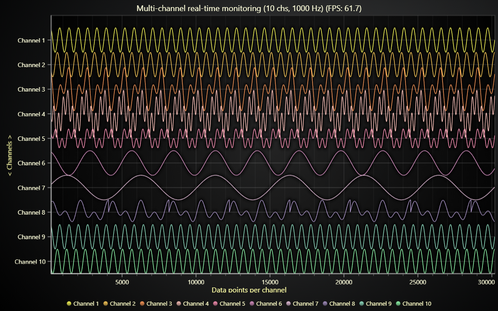

# Real-time data monitoring JavaScript Chart

This demo application belongs to the set of examples for LightningChart JS, data visualization library for JavaScript.

LightningChart JS is entirely GPU accelerated and performance optimized charting library for presenting massive amounts of data. It offers an easy way of creating sophisticated and interactive charts and adding them to your website or web application.

The demo can be used as an example or a seed project. Local execution requires the following steps:

-   Make sure that relevant version of [Node.js](https://nodejs.org/en/download/) is installed
-   Open the project folder in a terminal:

          npm install              # fetches dependencies
          npm start                # builds an application and starts the development server

-   The application is available at _http://localhost:8080_ in your browser, webpack-dev-server provides hot reload functionality.

## Description

_Multi-channel real-time data monitoring Line Chart_

Lightning-fast Line Chart visualization over multiple channels that progress on the same X Axis

Widely used in all kinds of fields for monitoring live data from many (hundreds or even thousands) of data sources at the same time.

Frames rendered per second (_FPS_) is recorded live, and displayed on the Chart title. FPS of 40-60 indicates a smooth running performance.

## Automatic data cleaning

In infinitely scrolling applications, cleaning old out of view data is extremely crucial;
in this example `LineSeries.setMaxPointsCount` method is used to enable automatic data cleaning.
For reference, see also `LineSeries.setDataCleaningThreshold`.

The `setMaxPointsCount` method sets the _amount of data points_, that will always be retained in the _series head_ (latest data).
The full conditions for valid _data cleaning_ are:

1. There is a considerably large chunk of data out of view (visible data is not cleaned!).
2. If the chunk is removed, the amount of data that remains is still more than _max points count_.

In practice, this results in an application where you can even scroll back for some distance and see older data, but if you scroll far enough, you will find that the old data has been _cleaned_. This allows the application to run _forever_!

## API Links

* [XY cartesian chart]
* [Line series]
* [Data patterns]
* [Axis]

## Support

If you notice an error in the example code, please open an issue on [GitHub][0] repository of the entire example.

Official [API documentation][1] can be found on [LightningChart][2] website.

If the docs and other materials do not solve your problem as well as implementation help is needed, ask on [StackOverflow][3] (tagged lightningchart).

If you think you found a bug in the LightningChart JavaScript library, please contact sales@lightningchart.com.

Direct developer email support can be purchased through a [Support Plan][4] or by contacting sales@lightningchart.com.

[0]: https://github.com/Arction/
[1]: https://lightningchart.com/lightningchart-js-api-documentation/
[2]: https://lightningchart.com
[3]: https://stackoverflow.com/questions/tagged/lightningchart
[4]: https://lightningchart.com/support-services/

© LightningChart Ltd 2009-2022. All rights reserved.

[XY cartesian chart]: https://lightningchart.com/js-charts/api-documentation/v7.1.0/classes/ChartXY.html
[Line series]: https://lightningchart.com/js-charts/api-documentation/v7.1.0/classes/LineSeries.html
[Data patterns]: https://lightningchart.com/js-charts/api-documentation/v7.1.0/interfaces/DataPattern.html
[Axis]: https://lightningchart.com/js-charts/api-documentation/v7.1.0/classes/Axis.html

